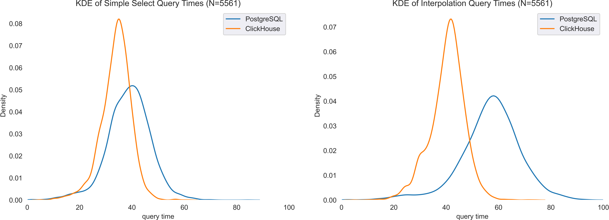

# Agenda

- showcase of open smart meter data import and interpolation.
- review process of loading data using duckdb as gateway to parallelism.
- usage of OLAP database (ClickHouse) and dbt for query handling and auto-docs.
- comparison of ballparks for disk-usage and query speed against postgres

#### Disclaimer
- I've neither used ClickHouse nor dbt professionally.
- Some measurements and calculations may be slightly off, but ballpark should be right.

So, let's go 🙃

---

# Data used here

A quick sample of the [kaggle](https://www.kaggle.com/datasets/jeanmidev/smart-meters-in-london) data, such that labels and usage aren't too misterious:

| LCLid [id] | tstp [ts]           | energy(kWh/hh) [val] |
| ---------- | ------------------- |--------------------- |
| MAC000002  | 2013-06-03 13:30:00 |                0.096 |
| MAC000002  | 2013-06-03 14:00:00 |                0.129 |
| MAC000246  | 2013-06-03 13:30:00 |                0.022 |
| MAC000246  | 2013-06-03 14:00:00 |                0.044 |
| MAC003223  | 2013-06-03 13:30:00 |                0.232 |
| MAC003223  | 2013-06-03 14:00:00 |                0.127 |

---

# ClickHouse 101

ClickHouse...

- was created for real-time analytics of large datasets.
- has its own SQL dialect and has some fine-grained controls when designing tables (e.g. engines and order by).
- is a column-orientated warehouse, which allows to compress the stored data.
  - allows for fast aggregation of averages, standard deviations, etc.
- uses sparse indexes on sorted tables.
  - thus minimal primary key size, despite large table sizes.
- has no transactions
---

## ClickHouse DDL

Imagine we've got some data about [smart meters in London from kaggle](https://www.kaggle.com/datasets/jeanmidev/smart-meters-in-london)

```sql
create or replace table meterdata_raw.meter_halfhourly_dataset (
    id  String,
    ts  DateTime('UTC') CODEC(Delta, ZSTD),
    val Float32
)
engine = ReplacingMergeTree
primary key (id, ts)
order by (id, ts);
```

Let's talk now about how the data got there and in what time.

---


## Loading Data into ClickHouse Pt.1

Use duckdb to generate one Parquet file from the 111 csvs with filter and large row groups:

```sql
copy (
    select
        "LCLid"          as id,
        "tstp"           as ts,
        "energy(kWh/hh)" as val
    from read_csv(
            'data/raw/halfhourly_dataset/halfhourly_dataset/block_*.csv', -- regex possible
            delim   = ',',
            header  = true,
            nullstr = 'Null',
            columns ={ 'LCLid': 'VARCHAR', 'tstp': 'TIMESTAMP', 'energy(kWh/hh)': 'FLOAT' }
        )
    where "energy(kWh/hh)" is not null
    )
    to 'data/ready/halfhourly_dataset.parquet' (
        format         'parquet',
        compression    'zstd',
        row_group_size 1000000  -- this one does the magic trick 🪄
);
```

---

## Loading Data into ClickHouse Pt.2.1

Let's quickly walk through how to load the resulting single 335MB parquet file.

In the end, the insert will look very familiar:

```py
from ClickHouse_driver import Client

def insert_data(data):
    with Client("localhost") as client:
        client.execute(
            query="insert into meterdata_raw.meter_halfhourly_dataset (id, ts, val) values",
            params=data,
            types_check=True,
        )
```

Note that there is nothing ClickHouse specific. But maybe, the parallelization works much better. However, I didn't try this strategy on Postgres yet (not true anymore 🤭). Thus, I've completely shifted the focus of the slides to come.

---

## Loading Data into ClickHouse Pt.2.2

Each row group is designed to be of around 2 Mrows here. I've added the time and percentange of each step.

```py
def insert_row_group(args):
    file_path, row_group_index = args

    # read (0.4%, 0.01s)
    parquet_file = pq.ParquetFile(file_path)  # Open the Parquet file within the worker process
    table = parquet_file.read_row_group(row_group_index)

    # transpose (43,3%, 1.23s)
    data = list(zip(*[tuple(row) for row in table.to_pydict().values()]))  # 😕

    # insert (56,3%, 1.60s)
    insert_data(data=data)
```

Note that we have **170 row groups** here, the measurements are an average over those 170 calls.
Half the time is spend converting the pyarrow table to a list for the insert... That's tragic.

---

## Loading Data into ClickHouse Pt.2.3

The magic is in the row groups, and allows the single file to be read in parallel from multiple processes without blocking 🤯

```py
def insert_file_content(table_name: str):
    file_path = f"data/ready/{table_name}.parquet"
    parquet_file = pq.ParquetFile(file_path)
    print(f"Number of row groups: {parquet_file.num_row_groups}")
    with Pool() as pool:
        pool.map(
            insert_row_group,
            [(file_path, i) for i in range(parquet_file.num_row_groups)],
        )
```

Running this on the M1 with 8 cores, takes less than 100 seconds in total for 170 row groups of 1 Mrows. Each row group takes approximately 2,84 seconds. So roughly 168.000.000 rows in total.

---


# Measuring Time and Space

Let's summarize where time was spend reading those 167 Mrows, corresponding to 7.3 GB csv file size and 475.35MB in ClickHouse tables size.

| Step                 | time taken   |
| ---                  | ---          |
| csv2parquet (duckdb) |    19.5s     |
| insert into          |   272.2s     |
| **Total**            | **291.7s**   |

Note that we can parallelize this perfectly, thus we can device the parallel step by the number of available cores.

---

## Measuring Time and Space: With Postgres added

It was just too simple as not to try this in Postgres. Just for symbolic purposes, let's update the table and have some interim conclusion.

| Step                 | time taken   | postgres     |
| ---                  | ---          | ---          |
| csv2parquet (duckdb) |    19.5s     |              |
| insert into          |   272.2s     | 3503.5s      |
| **Total**            | **291.7s**   | **+3231.3s** |

That's a factor of more than **12** and there's no sign of slowdown on this advantage in table size. The numbers do only relate to the insert into query, not the load ot transpose parts. Recall that this is perfectly parallelizable using the row groups.

---

## Digression: DDL of PostreSQL Tables

```sql
create table core.devices (
    id   uuid         primary key,
    name varchar(255) not null
);

create table core.measurements (
    device_id uuid                        references core.devices(id),
    ts        timestamp without time zone not null,
    val       float4                      not null,
    primary key (device_id, ts)
);
```

---

## Measuring Space: Postgres Table Sizes

Note that we've got only one table in Clickhouse, but the size of the devices table in postgres is negligible:
- ch: 475MB
- pg: 20.65GB total table size with 11.24GB index size

So, **compression** saves us a **factor of 44** compared to the 475MB in ClickHouse.
I cannot overstate how magical this feels, and later we'll see that the queries aren't even slower...

---

## ClickHouse Compression

Maybe, it becomes tangible here how compression works using column-storage:

- A single `id` appears repeatedly, so the data structure will only store something like "id x repeats 1000 times here". Thus, there is only little cost of using a String with the external id.
- At the same time the `ts` has some regularity, such that there's no need to store the unix timestamp itself, but rather the difference between two neighboring rows ([Delta Encoding](https://altinity.com/blog/2019/7/new-encodings-to-improve-ClickHouse))
- Keep in mind, that compression not only reduces storage cost, but additionally reduces the cost of scanning data, as there is simply less to scan.
- We'll also see that this allows for **fast copies of data**, when moving data to new tables.
    - So, let's start to create some tables or models as they are called in dbt.

---

# dbt 101

dbt is...

- an abbreviation for _data build tool_ and reflects only the T of ETL (Extract, Transform, Load) patterns in a DWH context.
- is an open source solution to programatically design data transformations in a data warehouse.
- uses jinja templates which allows to re-use components (macros) and implements simple control flows (if-else, for loops, etc).
- includes a testing framework.
- auto-generates documentation of pipelines, tests, tables and columns.
- simplyfies writing data pipelines, as it reduces the input needed to a simple query and handles all the orchestration around it.

---

## ClickHouse + dbt: Defining a schema

dbt must learn about tables that are not managed by it, thus sources are described in yaml notation, which are used to auto-gen docs later.

```yml
version: 2

sources:
  - name: meterdata
    database: meterdata_raw  # note that ClickHouse has no notion of a schema
    tables:
      - name: meter_halfhourly_dataset
        columns:
          - name: id
            description: External ID of smartmeter
            tests:
              - not_null
          ...  # save some slide-space
```

---

## ClickHouse + dbt: First Model

A model is only a query that results in a table or view and expressed in SQL (here, ClickHouse dialect). Let's kick of with a simple candidate here, that shows to the previously defined table will be referenced.

```sql
{{config(order_by=('id'))}}

with ( select avg(val) from {{ source('meterdata', 'meter_halfhourly_dataset') }} ) as global_avg_ec
select
    id,
    max(val)                 as p_max,
    avg(val) / global_avg_ec as scaling_factor
from {{ source('meterdata', 'meter_halfhourly_dataset') }}
group by id
order by id
```

Note that all jinja stuff `{{ }}` is later build (thus build tool) by dbt. The configs are ClickHouse specific. Here, a MergeTree is used. If no primary key is given, the order by clause applies.

---

## ClickHouse + dbt: Second Model

Another quite simple example, which will however help us to illustrate how tests work in the next step:

```sql
{{config(order_by=('dt', 'ts'))}}

with years as (
    select distinct year(ts) as year
    from {{ source('meterdata', 'meter_halfhourly_dataset') }}
)
select
    makeDate(years.year, month(ts), day(ts) ) as dt,
    makeDateTime(years.year, month(ts), day(ts), hour(ts), 0, 0, 'UTC') as ts,
    avg(val) as val
from {{ source('meterdata', 'meter_halfhourly_dataset') }}
     cross join years
group by dt, ts
order by dt, ts
```

---

## ClickHouse + dbt: First Test

Oftentimes, tests in SQL are defined, such that the expected result is empty. This allows to test for unexpected data. Here, I want the standard load profile to be in one hour intervals from the first to last timestamp.

ClickHouse's neighbor keyword: Similar to Postgres' `lead(ts) over (partition by id order by ts)`. Recall that the order by clause is set in the table definition, which enables this to be fast ⚡️

```sql
select ts
from {{ ref('standard_load_profile') }}
where ts - neighbor(ts, 1) > 60 * 60
  and year(neighbor(ts, 1)) != 1970 -- last row would be succeeded by 1970-01-01 00:00:00
```

Core take-away: dbt-defined tables are referenced using the `source` and `ref` syntax, which allows dbt to build a DAG.

---


# Timeseries interpolation PoC

My goal was to completely rely on (ClickHouse's) native SQL syntax and avoid any stored procedure.
The following steps have been taken to do so:
- Create a row for each timeseries gap larger than 60 minutes with start and end timestamp.
- Split each of those rows by day to allow to join against the SLP.
- Join standard load profile and scale by participants `p_max`.
- Build union of raw data and interpolated data.

Any interpolation below 1 hour can be done later when querying the data, such that we don't need to store simple linear interpolation steps. Snippet follows.

---

## Timeseries interpolation: Gap Finding

I'll leave the `{{config=...}}`` stuff out here.

```sql
select
    id,
    rowNumberInAllBlocks() as gap_id, -- generates row ID
    ts,
    neighbor(ts, 1) as next_ts,
    val,
    neighbor(val, 1) as next_val
from {{ source('meterdata', 'meter_halfhourly_dataset') }}
where next_ts - ts > 30 * 60 -- fill gaps larger than 30 mins
  and neighbor(id, 1) = id
order by id, ts
```

Why 30 min: 11:30 - 12:30 is only an hour, but 11:00 is missing. Before we've filtered

---

## Timeseries interpolation: Split Gaps by Day

Main Takeaway: ClickHouse has some useful built-in functions:

```sql
select
    id,
    gap_id,
    arrayJoin(
        arrayDistinct(
                arrayMap(
                    x -> toDate(x, 'UTC'),
                    range(toUInt32(ts), toUInt32(next_ts), 30 * 60)
                )
        )
    ) as dt,
    case
        when dt == ts::Date
            then greatest(ts, dt::Timestamp('UTC') + interval 0 hour)
        else makeDateTime(year(dt), month(dt), day(dt), 0, 0, 0, 'UTC')
    end as start_ts,
    case
        when dt != next_ts::Date
            then  makeDateTime(year(dt), month(dt), day(dt), 23, 0, 0, 'UTC')
        else least(next_ts, dt::Timestamp('UTC') + interval 23 hour + interval 30 minute)
    end as end_ts
from {{ ref('boundaries') }}
order by id, gap_id, dt, start_ts
```

---

## Timeseries interpolation: Interpolate with SLP

```sql
select
    bbd.id as id,
    bbd.gap_id as gap_id,
    slp.ts as ts,
    slp.val * p.scaling_factor as val
from {{ ref('boundaries_by_date') }} as bbd
inner join {{ ref('standard_load_profile') }} as slp on bbd.dt = slp.dt
inner join {{ ref('participants') }} as p on bbd.id = p.id
where slp.ts >= bbd.start_ts
  and slp.ts <= bbd.end_ts
  and (id, ts) not in (
    select id, ts
    from {{ ref('interpolation_long_interval_bounds') }}
)
order by id, gap_id, ts
```

where the `interpolation_long_interval_bounds` are just the timestamp bounds of a gap, which becomes necessary due to split by day, which was necessary to construct a memory sparing inner join.

---

## Timeseries interpolation: dbt run

So, let's run our model and see how long it takes.

```
(.meterdata) ➜  metermodel git:(main) ✗ dbt run
09:57:35  Found 7 models, 6 tests, 0 snapshots, 0 analyses, 319 macros, 0 operations, 0 seed files, 2 sources, 0 exposures, 0 metrics
09:57:35
09:57:35  Concurrency: 1 threads (target='dev')
09:57:35
09:57:35  1 of 7 START sql view model meterdata.clean_source_data ........................ [RUN]
09:57:36  1 of 7 OK created sql view model meterdata.clean_source_data ................... [OK in 0.06s]
09:57:36  2 of 7 START sql table model meterdata_gaps.boundaries ......................... [RUN]
09:57:36  2 of 7 OK created sql table model meterdata_gaps.boundaries .................... [OK in 0.74s]
09:57:36  3 of 7 START sql table model meterdata.participants ............................ [RUN]
09:57:37  3 of 7 OK created sql table model meterdata.participants ....................... [OK in 0.83s]
09:57:37  4 of 7 START sql table model meterdata_slp.standard_load_profile ............... [RUN]
09:57:41  4 of 7 OK created sql table model meterdata_slp.standard_load_profile .......... [OK in 3.81s]
09:57:41  5 of 7 START sql table model meterdata_gaps.boundaries_by_date ................. [RUN]
09:57:41  5 of 7 OK created sql table model meterdata_gaps.boundaries_by_date ............ [OK in 0.03s]
09:57:41  6 of 7 START sql table model meterdata_gaps.interpolation_long_intervals ....... [RUN]
09:57:42  6 of 7 OK created sql table model meterdata_gaps.interpolation_long_intervals .. [OK in 0.66s]
09:57:42  7 of 7 START sql table model meterdata.target .................................. [RUN]
09:57:53  7 of 7 OK created sql table model meterdata.target ............................. [OK in 11.13s]
09:57:53
09:57:53  Finished running 1 view model, 6 table models in 0 hours 0 minutes and 17.69 seconds (17.69s).
09:57:53
09:57:53  Completed successfully
09:57:53
09:57:53  Done. PASS=7 WARN=0 ERROR=0 SKIP=0 TOTAL=7
```

---

## Timeseries interpolation: SLP calculation in Postgres

You know, I like this type of comparison. The following query takes 3.8s in ClickHouse and 350s in Postgres on the indexed table. That's a factor of **92**. Just to take on the OLAP style query performance benefit...

```sql
INSERT INTO slp.standard_load_profile
WITH years AS (
    SELECT DISTINCT extract(YEAR FROM ts)::INTEGER AS year
    FROM raw.meter_halfhourly_dataset
)
SELECT
    make_date(years.year, extract(MONTH FROM ts)::INTEGER, extract(DAY FROM ts)::INTEGER) AS dt,
    make_timestamptz(
        years.year, extract(MONTH FROM ts)::INTEGER, extract(DAY FROM ts)::INTEGER,
        extract(HOUR FROM ts)::INTEGER, 0, 0, 'UTC'
        ) AS ts,
    avg(val) AS val
FROM raw.meter_halfhourly_dataset CROSS JOIN years
WHERE extract(MONTH FROM ts)::INTEGER != 2 and extract(DAY FROM ts)::INTEGER != 29
GROUP BY years.year, dt, ts ORDER BY dt, ts;
```

---


## Timeseries interpolation: dbt run

Probably a Postgres comparison would be valuable here, but as I've used some ClickHouse specific functions there would be a real kind of "translation" necessary. Nevertheless, I cannot imagine Postgres finish this task in anything close to 18 seconds.

Any operation over the full table instead of single rows of a table should always lead to the OLAP database being on top.

Nevertheless, any operation that retrieves small parts of the table should always favor the OLTP database. So let's have a look at this before fading out.

---

## Interpolation: Linear interpolation

If intervals of less than 60 minutes are interpolated linearly, this can be done while fetching the data instead of blowing up the table:

```sql
with meterdata as (
    -- This first part will be called "Simple Select" two slides later.
    select id, ts, val
    from meterdata.target
    where id = 'MAC005558'

    union all

    select id, ts + interval 30 minute as ts, (val + neighbor(val, 1)) / 2 as val
    from meterdata.target
    where id = 'MAC005558'
      and neighbor(ts, 1) - ts = 60 * 60
      and neighbor(val, 1) is not null
)
select * from meterdata order by id, ts
```

This query returned in 60ms in PyCharm. Again, I didn't construct the Postgres query, but I would expect it to be faster.

---

## Interpolation: Linear Interpolation Query in Postgres

Same story as always, I just wanted to know:

```sql
WITH meterdata AS (
    -- This first part will be called "Simple Select" on the next slide.
    SELECT id, ts, val
    FROM raw.meter_halfhourly_dataset
    WHERE id = ( select id from raw.device_ids where device_id = 'MAC005558')

    UNION ALL

    SELECT id, ts + INTERVAL '30 minute' AS ts, (val + LEAD(val) OVER (PARTITION BY id ORDER BY ts)) / 2 AS val
    FROM (
        SELECT
            id, ts, val,
            LEAD(ts) OVER (PARTITION BY id ORDER BY ts) AS next_ts,
            LEAD(val) OVER (PARTITION BY id ORDER BY ts) AS next_val
        FROM raw.meter_halfhourly_dataset
        WHERE id = ( select id from raw.device_ids where device_id = 'MAC005558')
    ) AS subquery
    WHERE next_ts - ts = INTERVAL '1 hour' AND next_val IS NOT NULL
)
SELECT * FROM meterdata ORDER BY id, ts;
```

---

## Point Queries: Postgres vs Clickhouse

Note that I didn't fill the gaps in Postgres, so there is strictly less data. I must confess I'm a bit surprised by those benchmarks. Maybe, it is as we are selecting complete timeseries instead of a single row...



---

# Summary

- **Point Queries**:
    - I did all comparisons against basic postgres, and not Timescale.
    - Point queries took full length of timeseries and not months or alike.
    - Nevertheless, I'd argue they are **on par** for the type of query we're interested in.
- Storage claims will be unaffected by that:
    - Clickhouse spares **disk space** by a **factor of 44**
- Aggregation queries seems to be almost **two orders of magnitude** faster.
- **Insertion** is faster by a **factor of 12**
    - Neverthess, I'm still hoping for a [ADBC](https://arrow.apache.org/docs/format/ADBC.html) implementation in ClickHouse...

- I think it's worth moving the historic timeseries processing to ClickHouse.
